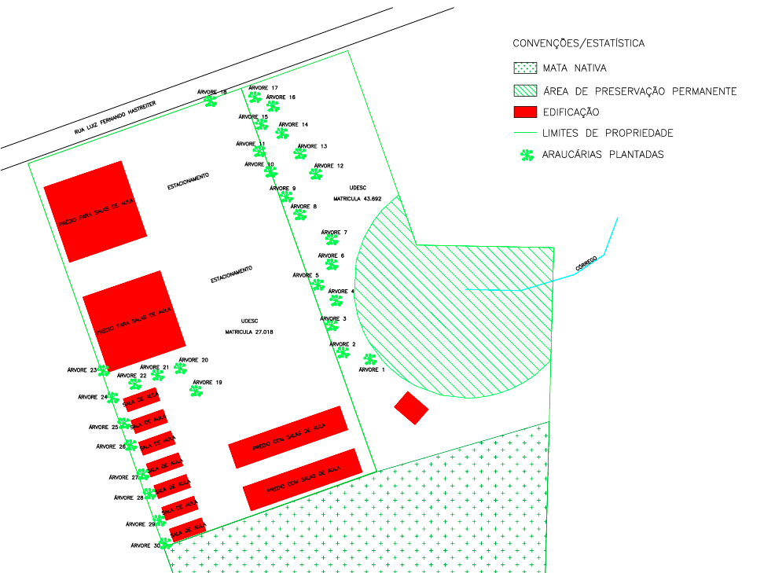

# Mapa-interativo-
index.html.
<!DOCTYPE html>
<html lang="pt-BR">
<head>
    <meta charset="UTF-8">
    <meta name="viewport" content="width=device-width, initial-scale=1.0">
    <title>Mapa Interativo</title>
    
</head>
<body>
    <h1>Mapa Interativo</h1>
    

        
        
        <!-- Exemplo de áreas clicáveis -->
        

        

    

    
    

    
    
</body>
</html>
